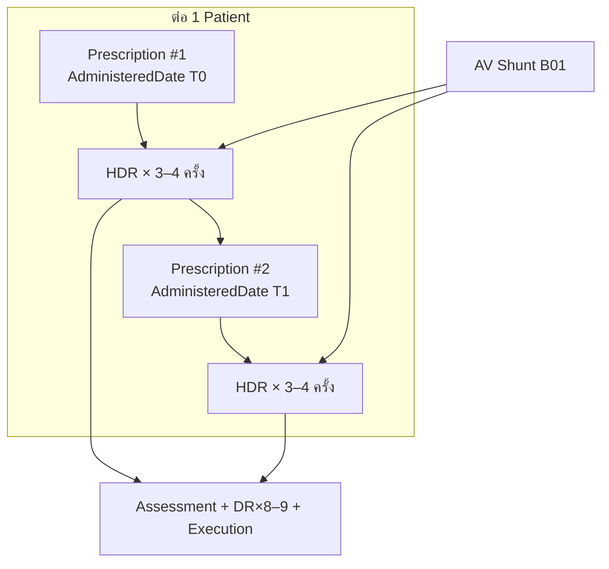
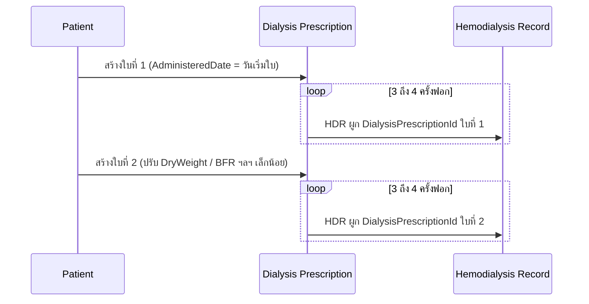

# Hemodialysis — สเปกข้อมูล “1 ครั้งฟอกไตสมบูรณ์”

> แกะจาก screenshot UI (DIALYSIS OVERVIEW / ASSESSMENT / RECORDS) + อ้างอิง seed `B01` / `B02` / `B03`  
> ใช้เป็นแหล่งความจริงสำหรับ generator, validation, หรือ agent กรอกข้อมูล  
> **ตัวอย่างอ้างอิง:** รอบ 21/05/2026 — ผู้ป่วย A (HD#101, Bed 10, รอบ 10:00–14:37) และผู้ป่วย B (HD#372, Bed 5, รอบ 06:00–10:29)

---

## สารบัญ

1. [ภาพรวมความสัมพันธ์](#ภาพรวมความสัมพันธ์)
2. [วงจร Dialysis Prescription (หลายใบต่อผู้ป่วย)](#วงจร-dialysis-prescription-หลายใบต่อผู้ป่วย) — **ใหม่**
3. [Dialysis Prescription](#1-dialysis-prescription)
4. [Hemodialysis Record](#2-hemodialysis-record)
5. [AV Shunt](#3-av-shunt)
6. [Dialysis Record (รายช่วง)](#4-dialysis-record-รายช่วง)
7. [Assessment](#5-assessment)
8. [Execution Record](#6-execution-record)
9. [กฎข้าม entity](#กฎข้าม-entity-ที่ต้องผูกกัน)
10. [ลำดับการสร้างข้อมูล (workflow)](#ลำดับการสร้างข้อมูล-workflow)
11. [หมายเหตุสำหรับ seed / generator](#หมายเหตุสำหรับ-seed--generator)

---

## ภาพรวมความสัมพันธ์



| Entity | จำนวน (โมเดลใหม่) | แท็บ UI |
|--------|------------------|---------|
| Dialysis Prescription | **หลายใบต่อคน** — ใบละ **3–4** Hemodialysis แล้วออกใบใหม่ | Overview → Dialysis Prescription |
| Hemodialysis Record | 1 ต่อวันฟอก | Overview → Basic + Weight |
| AV Shunt | 1 (snapshot บน HDR) | Assessment |
| Assessment | 1 ชุด (หลายส่วนย่อย) | Assessment |
| Dialysis Record | **8–9** | Records |
| Execution Record | **0–n** (ตัวอย่างมี 1+) | Assessment / Execution Records |

---

## วงจร Dialysis Prescription (หลายใบต่อผู้ป่วย)

### สถานะ seed ปัจจุบัน (B02)

| หัวข้อ | ค่าปัจจุบัน |
|--------|-------------|
| จำนวนแถว B02 | **30** แถว |
| ความสัมพันธ์ | **1 PatientId → 1 PrescriptionId** (ไม่ซ้ำ PatientId ใน B02) |
| B03 อ้างอิง | ทุก Hemodialysis ของคนนั้นใช้ `DialysisPrescriptionId` **ใบเดียวกัน** ตลอด |
| `AdministeredDate` | กำหนดครั้งเดียวตอนสร้างใบ — มักเป็นวันเริ่ม schedule / section |

> **ใช่ครับ** — ตอนนี้ถือว่า “ผู้ป่วยหนึ่งคนมีใบสั่งหนึ่งใบ” เป็น baseline สำหรับ Hogwarts seed เท่านั้น  
> **โมเดล generator รอบใหม่ไม่ใช้แบบนี้**

### โมเดลเป้าหมาย (generator ต้องสร้าง B02 ด้วย)



| กฎ | รายละเอียด |
|----|-------------|
| อายุใบสั่ง | หนึ่งใบใช้กับ **3–4** Hemodialysis Records แล้ว “จบ episode” |
| ใบถัดไป | สร้าง Prescription ใหม่ — `Id` ใหม่, `AdministeredDate` = **วัน Hemodialysis ครั้งแรกภายใต้ใบใหม่** |
| สิ่งที่เปลี่ยนได้ระหว่างใบ | `DryWeight` ±0.5–1.5 kg, `BloodFlow` ±10–30, `DialysateFlowRate`, `HCO3`/`Na`, `AcPerSession`, `Frequency` (1–3), `Dialyzer`/`AvgDialyzerReuse` เป็นครั้งคราว |
| สิ่งที่มักคงที่ | `PatientId`, `BloodAccessRoute` (จาก B01), `Mode`/`Anticoagulant` (เปลี่ยนนาน ๆ ครั้ง) |
| `Temporary` | seed เดิม = `FALSE` — ใบใหม่ทุกใบเป็น long-term episode เช่นกัน |

### อัลกอริทึมสำหรับ Python (pseudo)

```text
state[patient_id] = {
  active_prescription,   # แถว B02 ปัจจุบัน
  sessions_on_rx: int,  # นับ HDR ที่สร้างแล้วภายใต้ใบนี้
  max_sessions: 3|4,    # สุ่มครั้งเดียวต่อ episode (seed ตาม patient+episode)
}

for each dialysis_business_day(patient):
  if state.sessions_on_rx >= state.max_sessions:
    state.active_prescription = clone_and_mutate(state.active_prescription)
    state.active_prescription.AdministeredDate = วันนี้ + เวลา section
    state.sessions_on_rx = 0
    state.max_sessions = random_choice([3, 4], seed=...)
    append INSERT B02

  hdr = build_hemodialysis_record(
    prescription=state.active_prescription,
    treatment_no=increment_per_patient,
    ...
  )
  append INSERT B03 (+ Assessment, DialysisRecord, Execution ตามสเปก)
  state.sessions_on_rx += 1
```

### ความสัมพันธ์กับ TreatmentNo vs Prescription

| ตัวนับ | ขอบเขต | หมายเหตุ |
|--------|--------|----------|
| `TreatmentNo` (HD No.) | **ต่อผู้ป่วย ตลอดชีวิตใน seed** | เพิ่มทุกครั้งฟอก ไม่รีเซ็ตเมื่อเปลี่ยนใบสั่ง |
| Episode ใบสั่ง | รีเซ็ตทุก 3–4 ครั้ง | ใช้แค่ตัดใบ B02 ใหม่ |
| `DialysisPrescriptionId` บน HDR | เปลี่ยนเมื่อขึ้นใบใหม่ | Overview แสดงค่าจากใบที่ผูกกับรอบนั้น |

### ตัวอย่าง timeline (Frequency = 2 ครั้ง/สัปดาห์)

| ลำดับ | วันฟอก | ใบสั่ง | หมายเหตุ |
|-------|---------|--------|----------|
| 1 | จ. 1 | Rx#1 | AdministeredDate = จ. 1 |
| 2 | พฤ. 4 | Rx#1 | |
| 3 | จ. 8 | Rx#1 | ครั้งที่ 3 ภายใต้ Rx#1 |
| 4 | พฤ. 11 | Rx#2 | ครบ 3 ครั้ง → ใบใหม่, DryWeight ลด 0.5 |
| 5 | จ. 15 | Rx#2 | |
| … | … | … | ทุก 3–4 HDR → Rx ใหม่ |

### Seed เดิม → generator ใหม่

| แหล่ง | การใช้ |
|-------|--------|
| `B02-DialysisPrescriptions.sql` (30 แถว) | **Template เริ่มต้น** สำหรับ patient แต่ละคน (ค่า baseline ครั้งแรก) |
| `scripts/legacy/generate_b03_incremental.py` | ต้องขยาย → สร้าง/ต่อ B02 + B03 (ไม่ clone B03 อย่างเดียว) |
| ไฟล์ output แนะนำ | `B02.incremental.sql`, `B03.incremental.sql` หรือ merge เข้า base |

---

## 1. Dialysis Prescription

**ที่มา:** แท็บ Overview → ส่วน *Dialysis Prescription* (ค่าสะท้อนจาก `DialysisPrescriptions` / B02)  
**บทบาท:** **หลัก (master) ของรอบฟอก** — แต่ละ Hemodialysis Record ต้องผูก `DialysisPrescriptionId` ของ **ใบที่ active ในวันนั้น** (ไม่ใช่ใบเดียวตลอดชีวิต)

**การสร้างใบใหม่:** ไม่ copy ค่าเดิมเป๊ะ — ใช้ `mutate_prescription(previous)` ตามช่วงในตารางด้านล่าง + กฎ episode ด้านบน

### ฟิลด์และช่วงค่าแนะนำ

| ฟิลด์ UI | บังคับ | ช่วง / ค่าที่ใช้ได้ | ตัวอย่างจากภาพ |
|----------|--------|---------------------|----------------|
| State | ใช่ | `Long-Term` (seed ส่วนใหญ่) | Long-Term |
| Mode | ใช่ | `HD`, `HDF` | HDF |
| Duration | แนะนำ | `04:00:00` – `05:30:00` (time span) | ว่างใน UI แต่ B02 ใช้ ~05:20 |
| Frequency | ใช่ | `1`–`3` ครั้ง/สัปดาห์ | 2 หรือ 3 |
| Dry Weight | ใช่ | **50–80 kg** (ผู้ใหญ่ ESRD) | 63 / 57 kg |
| HDF Type | ถ้า Mode=HDF | `Pre`, `Post`, `Mixed` | Pre |
| Substitute Volume | ถ้า HDF | **30–60 L** | 46 L |
| Dialysate (K/Ca²⁺) | ไม่บังคับ | ข้อความหรือ `-` | - |
| HCO₃ | ใช่ | **28–36** | 32 |
| Na | ใช่ | **135–145** | 138 |
| Dialysate Temperature | ใช่ | **35.0–37.0 °C** | 36 / 36.5 |
| Dialysate Flow Rate | ใช่ | **400–600 ml/min** | 500 |
| Anticoagulant | ใช่ | `Heparin`, `Clexane`, … | Heparin / (จาก B02: Clexane) |
| Initial AC | ใช่ | **500–2000 unit** (Heparin) | 1000 / 1500 unit |
| Maintain AC rate | ใช่ | **300–1500 unit/hr** | 500 / 1500 unit/hr |
| Total AC / session | ใช่ | **1000–4000 unit** | 1500 / 3000 |
| Blood Access Route | ใช่ | สอดคล้อง AV Shunt | LT AVF / RT AVF |
| Blood Flow (BFR target) | ใช่ | **200–350 ml/min** | 250 / 300 |
| Dialyzer | ใช่ | ชื่อรุ่น | FDX-21 |
| Dialyzer Surface Area | ใช่ | **1.5–2.5 m²** | 2.1 |
| Average Dialyzer Reuse | แนะนำ | **1–20** | 10 / 15 |

### การ map กับ B02 (SQL)

| UI | คอลัมน์ B02 โดยประมาณ |
|----|------------------------|
| Dry Weight | `DryWeight` |
| Mode | `Mode` (enum 0=HD ฯลฯ) |
| Blood Flow | `BloodFlow` |
| Dialysate Flow Rate | `DialysateFlowRate` |
| HCO₃ / Na / Temp | `HCO3`, `Na`, `DialysateTemperature` |
| Anticoagulant | `Anticoagulant`, `InitialAmount`, `MaintainAmount`, `AcPerSession` |
| Blood Access Route | `BloodAccessRoute` |
| Dialyzer | `Dialyzer`, `DialyzerId`, `DialyzerSurfaceArea`, `AvgDialyzerReuse` |
| Frequency | `Frequency` |

---

## 2. Hemodialysis Record

**ที่มา:** Overview → *Basic* + *Weight & Dehydration* + metadata รอบ  
**ที่เก็บ:** `HemodialysisRecords` (B03)

### 2.1 Basic

| ฟิลด์ UI | บังคับ | ช่วง / ค่าที่ใช้ได้ | ตัวอย่าง |
|----------|--------|---------------------|---------|
| Ward | ใช่ | ชื่อ unit เช่น `Unit 1`, `Hogwarts` | Unit 1 |
| Bed | แนะนำ | **เลขเตียง 1–20** + รุ่นเครื่องในวงเล็บ | `10 (Nikkiso DBB-05)` |
| Dialysis Type | ใช่ | `ESRD` (enum 0 ใน seed) | ESRD |
| Admission Type | ใช่ | `OPD`, `IPD` | OPD |
| Cycle Start Time | ใช่ | ตรง section schedule (05:00 / 09:00 / 13:00 / 17:00) | 10:00 / 06:00 |
| Cycle End Time | ใช่ | Start + **3:30–4:30 ชม.** | 14:00 / 10:00 |
| Completed Time | ใช่ | End + **0–45 นาที** | 14:37 / 10:29 |
| HD No. (TreatmentNo) | ใช่ | **1, 2, 3, …** ต่อเนื่องต่อผู้ป่วย | 101 / 372 |

### 2.2 Weight & Dehydration

| ฟิลด์ UI | บังคับ | ช่วง / สูตร | ตัวอย่าง A / B |
|----------|--------|-------------|----------------|
| Check-in Time | ใช่ | **Start − 15 ถึง 60 นาที** | 09:47 / 05:24 |
| Last Post-Dialysis Weight | แนะนำ | รอบก่อน: **dry ± 3 kg** | 63.3 / 60.0 |
| Pre-Dialysis Total Weight | ใช่ | **dry + 1.5 ถึง 4.0 kg** | 65.5 / 59.4 |
| Wheelchair Weight | ไม่บังคับ | 0–5 kg หรือ `-` | - |
| Cloth Weight | ไม่บังคับ | 0–2 kg หรือ `-` | - |
| Pre-Dialysis Weight (net) | ใช่ | ≈ Pre Total − wheelchair − cloth | 65.5 / 59.4 |
| Weight Gain (IDWG) | ใช่ | **Pre net − Last post** (ทศนิยม 1 ตำแหน่ง) | 2.2 / -0.6 |
| Target Dry Weight | ใช่ | จาก prescription ± **0.0–0.5** | 63.0 / 57.0 |
| UF Net (kg) | ใช่ | **Pre net − Target dry** (0.8–4.0) | 2.5 / 2.4 |
| Food/Drink Weight | ไม่บังคับ | 0–1 kg | - |
| Estimated UF Goal (L) | ใช่ | ≈ UF Net (kg) โดยประมาณ | 2.5 / 2.4 |
| UF Goal (L) | ใช่ | = Estimated UF Goal | 2.5 / 2.4 |
| Post-Dialysis Total | ใช่ | **Target dry ± 0.3 kg** | 63.1 / 57.0 |
| Post-Dialysis Weight (net) | ใช่ | ≈ Post total − wheelchair | 63.1 / 57.0 |
| Actual Weight Loss | ใช่ | **Pre net − Post net** (ใกล้ UF Net) | 2.40 / 2.40 |

**สูตรที่ต้องผ่าน (validator):**

```
Pre net − Post net ≈ Actual loss  (±0.2 kg)
UF Goal (L) ≈ UF Net (kg)         (±0.2)
Pre net − Target dry ≈ UF Net
Check-in < CycleStart < CycleEnd ≤ Completed
```

### 2.3 ฟิลด์ B03 เพิ่ม (ไม่เห็นใน Overview แต่ seed ต้องมี)

| กลุ่ม | ฟิลด์ | แนวทาง |
|-------|-------|--------|
| FK | `PatientId`, `DialysisPrescriptionId`, `ShiftSectionId` | จาก patient + schedule |
| Dialyzer snapshot | `Dialyzer_*`, `Dialyzer_UseNo` | สอดคล้อง Assessment |
| AV Shunt snapshot | `AvShunt_*` | copy จาก B01 |
| พยาบาล | `NursesInShift` | **ไม่ควร `{}`** ถ้าต้องการครบ — ใส่ UUID 2–6 คน |
| อื่น | `Created`, `Updated`, `CreatedBy`, `TreatmentNo`, `DoctorId` | ตาม seed เดิม |

---

## 3. AV Shunt

**ที่มา:** Assessment → AV Shunt (+ บรรทัด Blood Access Route ใน Prescription)  
**แหล่ง master:** `AvShunts` (B01) — HDR เก็บ snapshot

| ฟิลด์ UI | บังคับ | ช่วง / ค่าที่ใช้ได้ | ตัวอย่าง |
|----------|--------|---------------------|---------|
| AV Shunt Site | ใช่ | รูปแบบ: `{Type} / {Side} / {Site}` | AV Fistula / Left / Forearm |
| Arterial Size (needle) | ถ้า fistula/graft | **14, 15, 16, 17** (gauge) | 17 |
| Venous Size (needle) | ถ้า fistula/graft | **14–17** | 17 |
| AC (บน shunt) | ตามชนิด | Heparin / Clexane / ว่าง (cath) | จาก B01 `Ac` |
| A/V Fill Volume | Perm Cath / AVG | **15–35 ml** | จาก B01 |
| A/V Catheter Volume | Perm Cath | **20–45 ml** | จาก B01 |
| A/V Needle Times | ไม่บังคับ | 1–3 | NULL หรือตัวเลข |

### ค่า CatheterType (B01 enum)

| Index | ความหมาย | Blood Access Route ตัวอย่าง |
|-------|----------|---------------------------|
| 0 | AVFistula | LT AVF / RT AVF |
| 1 | AVGraft | LT AVG / RT AVG |
| 2 | PermCath | Perm Cath |
| 3 | DoubleLumen | Double Lumen |

### Side

| Index | ค่า |
|-------|-----|
| 0 | Left |
| 1 | Right |

**ข้อควรสอดคล้อง:** `Blood Access Route` ใน Prescription ต้องตรงกับ `AvShunt_ShuntSite` / B01

---

## 4. Dialysis Record (รายช่วง)

**ที่มา:** แท็บ RECORDS — ฟอร์ม *Dialysis Record* (manual, **`isFromMachine = false`**)  
**จำนวน:** **8–9 records** ต่อ 1 Hemodialysis Record กระจายตลอดรอบ (~30 นาที/ครั้ง)

### 4.1 ข้อมูลหัวฟอร์ม (ทุกแถว)

| ฟิลด์ | บังคับ | ช่วง / กฎ | ตัวอย่าง (แถวกลางรอบ ~13:30) |
|-------|--------|-----------|------------------------------|
| Record Date/Time | ใช่ | ระหว่าง CycleStart–CycleEnd, **เรียงเวลาเพิ่ม** | 21/05/2026 13:30 |
| Machine Model | ใช่ | ตรง Bed เช่น `Nikkiso DBB-05/07` | Nikkiso DBB-05/07 |
| Machine Number | ใช่ | ตรงเลขเตียง | 10 |
| Remaining Time (H) | แนะนำ | **ลดจาก ~4:00 → 0:00** ตามลำดับแถว | 0 |
| Remaining Time (M) | แนะนำ | คู่กับ H — แถวสุดท้ายใกล้ 0 | 33 |

**ตัวอย่าง timeline 8 แถว (รอบ 10:00–14:00):**

| # | เวลาโดยประมาณ | Remaining (H:M) |
|---|----------------|-----------------|
| 1 | 10:30 | 3:30 |
| 2 | 11:00 | 3:00 |
| 3 | 11:30 | 2:30 |
| 4 | 12:00 | 2:00 |
| 5 | 12:30 | 1:30 |
| 6 | 13:00 | 1:00 |
| 7 | 13:30 | 0:33 |
| 8 | 14:00 | 0:00 |

### 4.2 Vitals & BFR (ฟอร์มหลัก)

| ฟิลด์ | บังคับ | ช่วง | ตัวอย่าง | แนวโน้มตามเวลา |
|-------|--------|------|---------|----------------|
| BPS | ใช่ | **90–200** mmHg | 170 | มักสูงตอนต้น ลดลงเล็กน้อยท้ายรอบ |
| BPD | ใช่ | **50–110** mmHg | 78 / 80 | คงที่ ±10 |
| MAP | ไม่บังคับ | คำนวณจาก BP หรือ **70–120** | ว่าง | ถ้ากรอก: ≈ BPD + (BPS−BPD)/3 |
| HR | ใช่ | **60–100** bpm | 73 / 80 | ค่อนข้างคงที่ |
| RR | แนะนำ | **12–24** /min | 20 หรือว่าง | |
| BFR | ใช่ | **prescription ± 50** ml/min | 200 (ขณะลด), target 250–300 | อาจต่ำกว่า target ช่วงต้น |
| Temperature | แนะนำ | **35.5–37.5** °C | 36.0 หรือว่าง | |

### 4.3 Machine parameters (หน้าจอรายละเอียดเพิ่ม)

| ฟิลด์ | บังคับ | ช่วง | ตัวอย่าง | กฎตามเวลา |
|-------|--------|------|---------|-----------|
| Venous Pressure | แนะนำ | **40–200** mmHg | 66 | |
| Arterial Pressure | แนะนำ | **−30 ถึง 50** mmHg | 0 | |
| Dialysate Pressure | แนะนำ | **−80 ถึง 0** mmHg | -39 | |
| TMP | แนะนำ | **50–150** mmHg | 76 | |
| UF Rate | แนะนำ | **0.3–1.2** L/hr | 0.63 | |
| UF Total | แนะนำ | **0 → UF Target** | 2.16 | **ต้องไม่ลด** และ ≤ Target |
| UF Target | ใช่ | = HDR `UF Goal` | 2.5 | คงที่ทุกแถว |
| Anticoagulant Accumulated | แนะนำ | **0–30** ml | 18.6 | เพิ่มช้าๆ |
| Maintaining Rate (AC) | แนะนำ | **0–10** ml/hr | 0 | |
| Dialysate Flow Rate | แนะนำ | **target ± 20** ml/min | 499.33 | ~500 |
| Dialysate Temp Target | แนะนำ | **35.0–36.5** °C | 35.5 | |
| Dialysate Temp | แนะนำ | target **± 0.5** | 35.4 | |
| Dialysate Conductivity | แนะนำ | **12–16** mS/cm | 14 | |
| Bicarbonate Conductivity | แนะนำ | **2.5–3.5** mS/cm | 2.98 | |
| Mode | แนะนำ | `OHDF`, `HDF`, `HD` | OHDF | สอดคล้อง Prescription |
| NSS / 50% Glucose | ไม่บังคับ | 0–500 ml | ว่าง | ใส่เมื่อมีเหตุ |

### 4.4 กฎความสมจริงระหว่าง 8–9 แถว

1. `RecordTime` เรียงจากน้อยไปมาก ภายใน `[CycleStart, CycleEnd]`
2. `RemainingTime` ลด monotonic (ไม่กระโดดขึ้น)
3. `UF Total` เพิ่มแบบเกือบ linear จนถึง ~90–100% ของ `UF Target` ที่แถวสุดท้าย
4. `BPS` แถวแรก ≥ แถวสุดท้าย โดยเฉลี่ย (ยกเว้นมี complication)
5. `BFR` แถวหลังๆ ใกล้ค่า prescription มากกว่าแถวแรก
6. ทุกแถว: `Machine Number` / `Machine Model` เหมือนกัน

---

## 5. Assessment

**ที่มา:** แท็บ ASSESSMENT — รวมหลายส่วนใน 1 ชุดต่อรอบ

### 5.1 Dialyzer (บน Assessment)

| ฟิลด์ | บังคับ | ช่วง | ตัวอย่าง |
|-------|--------|------|---------|
| Dialyzer | ใช่ | ชื่อรุ่น | FDX-21 |
| TCV (ml) | ไม่บังคับ | **0–500** หรือ NULL | - |
| Use No. | ใช่ | **1–20** | 2 |
| Grade | ไม่บังคับ | ตามระบบ | - |
| Blood Collection Pre | แนะนำ | `Yes` / `No` | No |
| Blood Collection Post | แนะนำ | `Yes` / `No` | No |
| Auto Stock | ไม่บังคับ | รายการ stock | ว่าง |

### 5.2 Vital Signs (ตาราง Pre / Post)

| คอลัมน์ | บังคับ | Pre-Dialysis | Post-Dialysis |
|---------|--------|--------------|---------------|
| Date/Time | ใช่ | **Start − 5 ถึง +30 นาที** | **End ถึง Completed** |
| Posture | แนะนำ | Sitting / Lying | Sitting / Lying |
| BPS | ใช่ | **130–190** | **110–170** |
| BPD | ใช่ | **70–100** | **60–95** |
| HR | ใช่ | **70–95** | **70–95** |
| RR | แนะนำ | **16–22** | **16–22** |
| SpO2 | แนะนำ | **95–100** % | **95–100** % |
| Temperature | แนะนำ | **35.8–37.0** °C | **35.8–37.0** °C |

**ตัวอย่างจากภาพ:** Pre 10:35 → 170/80, HR 80; Post 14:37 → 160/80, HR 80

**กฎ:** Post time > Pre time; Post BPS มัก ≤ Pre BPS หลังฟอก 5–20 mmHg

### 5.3 Nurse In Shift

| บทบาท | จำนวนแนะนำ | ตัวอย่าง |
|--------|------------|---------|
| HN | 1 | พัชรินทร์ นันสุข |
| RN | 1–3 | ปริยานุช สุกุหรี, สุดารัตน์ เอี่ยมละออ |
| PN | 2–5 | จิฬาวรรณ ศรีสิงห์, … |

**สำหรับ seed:** เก็บเป็น array UUID ใน `NursesInShift` — **อย่างน้อย 3–6 คน** ถ้าต้องการให้หน้าจอไม่ว่าง

### 5.4 Post Assessment (checkbox)

**รอบปกติ (ไม่มี complication) — ค่า default แนะนำ:**

| หมวด | เลือก |
|------|-------|
| Complication | `No complication` |
| Technical Complication | `No complication` |
| Health Education | 2–4 ข้อ: `Nutrition`, `Vascular access`, `Exercise` (สุ่มย่อย) |
| Nursing Intervention | `Monitor vital signs` (+ อื่นถ้ามี complication) |

**ถ้ามี Complication — ผูก intervention (ตัวอย่าง):**

| Complication | Nursing Intervention ที่สมเหตุ |
|--------------|-------------------------------|
| Hypo-tension | Trendelenburg, Pause ultrafiltration, Oxygen therapy |
| Muscle cramp | Hot compression, Decrease BFR |
| Hypertension | Monitor vital signs, Notified physician |
| Vascular access problem | Monitor access flow, Notified physician |

### 5.5 Signatures / Audit

| ฟิลด์ | บังคับ | ช่วง |
|-------|--------|------|
| Established (Created) | ใช่ | **Check-in ถึง Start** |
| Proof Reader | ไม่บังคับ | user UUID |
| SIGN / REQUEST | workflow | ตาม seed ไม่บังคับ |

---

## 6. Execution Record

**ที่มา:** Execution Records (มักอยู่ใต้ Assessment หรือส่วน medication)

| ฟิลด์ | บังคับ | ช่วง / ค่า | ตัวอย่าง |
|-------|--------|------------|---------|
| Execution Time | ใช่ | ภายใน `[CycleStart, CycleEnd]` | 14:00, 21 May 2026 |
| Item / Medication | ใช่ | ชื่อยา | Espogen |
| Prescribed amount | ใช่ | ข้อความปริมาณ | 4,000 unit |
| Prescribed route | ใช่ | IV / SC ฯลฯ | IV - ฉีดเข้าหลอดเลือดดำ |
| Administered Dose | ใช่ | **1–2** (vial/unit) หรือตามระบบ | 1 |
| Administered Route | ใช่ | ตรง prescribed | IV - ฉีดเข้าหลอดเลือดดำ |

**ยาที่พบบ่อยใน dialysis mock:**

| ยา | Dose ตัวอย่าง | Route |
|----|---------------|-------|
| Espogen (EPO) | 2,000–10,000 unit | IV / SC |
| Heparin | (มักอยู่ใน prescription) | IV |
| NSS | 50–200 ml | IV |

**จำนวนต่อรอบ:** 0–3 records (ตัวอย่างมี 1 รายการ)

---

## กฎข้าม entity ที่ต้องผูกกัน

| # | กฎ |
|---|-----|
| 1 | `HDR.DialysisPrescriptionId` = **ใบสั่ง active** ของ `PatientId` ในวันนั้น (episode ละ 3–4 HDR) |
| 1b | Hemodialysis ครั้งที่ 4 (หรือครบ `max_sessions`) ครั้งถัดไป → ต้องมีแถว B02 ใหม่ก่อนสร้าง HDR |
| 2 | `HDR.AvShunt_*` สอดคล้อง B01 ของคนเดียวกัน |
| 3 | `HDR.Dehydration_UFGoal` = `DialysisRecord.UF Target` ทุกแถว |
| 4 | `DialysisRecord` 8–9 แถว: `UF Total` สุดท้าย ≈ 85–100% ของ UF Target |
| 5 | `Assessment Pre` BP ใกล้ `DialysisRecord` แถวแรก (±15 mmHg) |
| 6 | `Assessment Post` time ≈ `CompletedTime` |
| 7 | `Execution` time ∈ [CycleStart, CycleEnd] |
| 8 | `TreatmentNo` เพิ่มทีละ 1 ต่อผู้ป่วย ไม่ซ้ำวันเดียวกัน (ยกเว้น design พิเศษ) |
| 9 | `Bed` + Machine model ตรงกับ `DialysisRecord.MachineNumber` |
| 10 | `Blood Flow` (prescription) เป็น ceiling ของ `DialysisRecord.BFR` |

---

## ลำดับการสร้างข้อมูล (workflow)

ลำดับที่สมเหตุสมเหตุผล (เหมือนพยาบาล):

1. **เปิดรอบ** — สร้าง Hemodialysis Record (Basic + Check-in + Pre weight)
2. **Assessment Pre** — vital signs ก่อนฟอก
3. **Dialysis Record #1–#2** — เริ่มเครื่อง, BFR ต่ำ, UF เริ่มน้อย
4. **Dialysis Record #3–#7** — กลางรอบ, UF Total เพิ่ม, Remaining ลด
5. **Execution Record(s)** — ยาระหว่างรอบ (ถ้ามี)
6. **Dialysis Record #8–#9** — ท้ายรอบ, UF Total ใกล้เป้า
7. **ปิดรอบ** — Post weight, Completed time
8. **Assessment Post** — vitals หลังฟอก + Post Assessment checkbox
9. **Nurse in shift / Sign** — ทำได้ตอนเปิดหรือก่อนปิด

---

## หมายเหตุสำหรับ seed / generator

### สิ่งที่ `scripts/legacy/generate_b03_incremental.py` ทำอยู่ตอนนี้

- เติมเฉพาะ **HemodialysisRecords** (B03) โดย clone แถว
- **ไม่สร้าง** DialysisRecord, Assessment, Execution
- จึงไม่ถึงเกณฑ์ “สมบูรณ์ 1 ครั้ง” ตามเอกสารนี้

### แนวทาง implement รอบถัดไป

1. โหลด B01 + **B02 template** (30 แถว) เป็นค่าเริ่ม episode แรกต่อคน
2. วนแต่ละวันฟอก: ตัดสินใจ **ใบสั่ง active** (สร้าง B02 ใหม่ทุก 3–4 HDR) → แล้วค่อยสร้าง HDR
3. สร้าง HDR จาก prescription active + สูตรน้ำหนัก (ไม่ clone แถว B03 ตรงๆ)
4. Generate 8–9 `DialysisRecord` ด้วย time-series simulator
5. Generate `Assessment` + `Execution` ตามตารางด้านบน
6. ใช้ **seed คงที่ต่อ (patientId + date + prescriptionEpisode)** เพื่อไม่ให้ค่าซ้ำทุกวัน

### ตัวอย่างค่าอ้างอิง 2 รอบ (สรุป)

| รายการ | รอบ A (Bed 10) | รอบ B (Bed 5) |
|--------|----------------|---------------|
| Cycle | 10:00–14:37 | 06:00–10:29 |
| Dry / Target | 63 / 63.0 | 57 / 57.0 |
| Pre weight | 65.5 | 59.4 |
| UF Goal | 2.5 L | 2.4 L |
| BFR target | 250 | 300 |
| HD No. | 101 | 372 |
| DR ตัวอย่าง BP | 170/78 @ 13:30 | (สร้างแนวเดียวกัน) |
| Assessment Pre/Post | 170/80 → 160/80 | สร้างตามช่วง |

---

## การอัปเดตเอกสาร

| วันที่ | หมายเหตุ |
|--------|----------|
| 2026-05-22 | สร้างจาก screenshot 8 รูป + B01/B02/B03 schema |
| 2026-05-22 | เพิ่มวงจร Prescription หลายใบต่อคน (3–4 HDR/ใบ) — แยกจาก seed 1:1 เดิม |

เมื่อมี export จาก DB ของรอบที่ “สมบูรณ์จริง” แล้ว แนะนำเพิ่ม appendix เป็นตัวอย่าง JSON 1 session เต็มชุด
